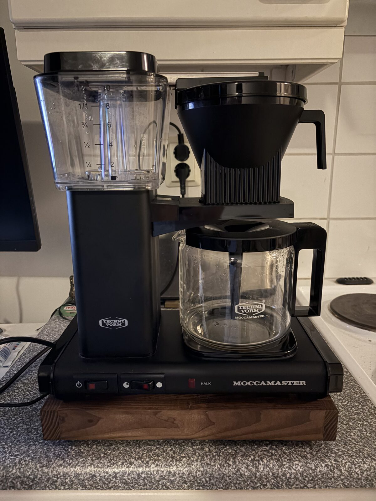
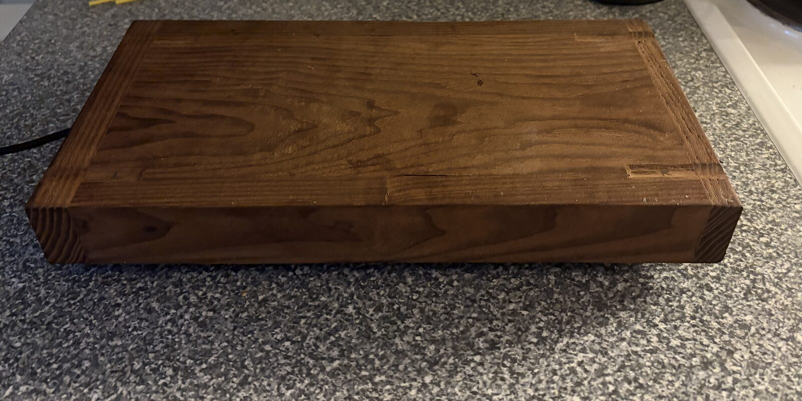
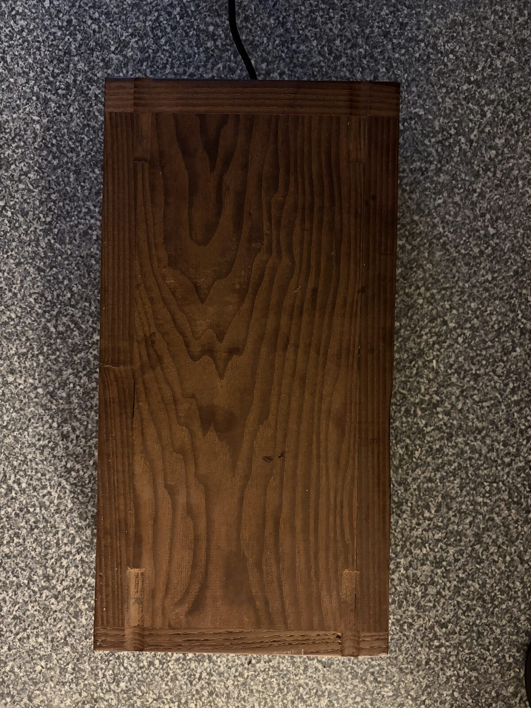
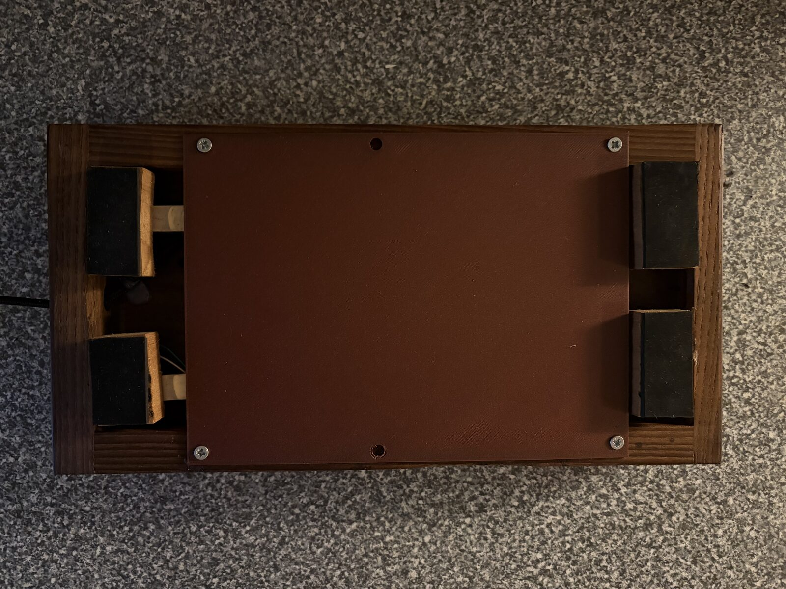

# ☕ Kahvibotti

**A coffee maker that knows how much coffee is left and tells you in Telegram.**

No more walking to the office kitchen only to find an empty pot. Type `/kahvi` in the group chat and the
bot answers within seconds:

> **/kahvi**
> 🤖 6 kuppia (keitetty klo 9.14)

*"6 cups (brewed at 9.14)"*. It also knows when coffee is being brewed and when it will be ready, when
someone is pouring, and when the pot has gone missing.

<p align="center">
  
</p>

A Moccamaster sits on a handmade wooden platform with load cells in its feet. A tiny ESP32-C3 inside weighs
the machine about once a second and works out what is going on from the way the weight changes. There are
no sensors on the coffee maker itself, and nothing is modified: you just put the machine on the platform.

---

## What it can tell

| The bot says | Meaning |
|---|---|
| **Kahvi keittymässä – n. 6 kuppia, valmis ~3 min** | Brewing: about 6 cups, ready in about 3 minutes |
| **6 kuppia (keitetty klo 9.14)** | About 6 cups in the pot, brewed at 9.14 (2-cup steps: 2, 4, 6, 8, 10) |
| **Tyhjä** | Empty: less than one cup left |
| **Pannu on jonkun kädessä – kysy hetken päästä uudelleen.** | Someone is pouring right now; ask again in a moment |
| **Pannu ei ole paikallaan.** | The pot has been away for over 15 minutes (probably in the dishwasher) |
| **Kahvinkeitin ei ole paikallaan.** | The whole coffee maker has been lifted off the platform |
| **Vaaka ei vastaa – en tiedä kahvitilannetta.** | The scale isn't responding, so the bot won't guess |

The bot never makes up an answer. If it can't know, it says so.

## How it works

Everything comes from **weight changes, per side**. The platform reads its left and right side separately,
and the Moccamaster conveniently has its water tank on the left and the pot on the right:

```
      left side                    right side
   ┌────────────┐              ┌──────────────┐
   │ water tank │  ── hot ──►  │ filter + pot │
   └────────────┘   water      └──────────────┘
   ▼ lighter                     ▲ heavier            total unchanged        → BREWING
                                 ▼ ~360 g + coffee    right side drops       → POURING
   ▼ much lighter                ▼ much lighter       over 1.5 kg at once    → MACHINE AWAY
```

- **Brewing** shows up as water moving from left to right while the total stays the same. The amount of
  water in the tank gives the number of cups, and the pumping speed gives the time until ready. Brewing is
  confirmed after 8 seconds of flow, so a bump on the table doesn't count.
- **The pot being lifted** is a large step down on the right side. The size of the step tells how much
  coffee was in it, and the step when it comes back tells what is left.
- **Classification goes by size first.** A small step (paper filter, grounds, lids, a mug) can never be the
  pot, and the whole machine is recognised by its size *and* by which way the weight shifts. Even a
  brim-full pot can't be mistaken for the machine.
- **The drip-stop is handled too.** A Moccamaster holds the coffee back while the pot is away, and the scale
  can't see that coffee. So the answer is "everything this brew makes, minus what was poured during it".
- **Failsafes:** wrong beliefs correct themselves at the next pot event. A hand leaning on the machine
  cancels out. Endless "flow" is capped at 15 minutes, and a stale tank-fill reading gets cross-checked.

A cup here means the same as the scale printed on the Moccamaster's water tank: 1 kuppi = 1.25 dl of
water, which gives about 1 dl of coffee in the pot. Some of the water stays in the grounds and the filter
paper, and some evaporates.

All the logic lives in [`kahvi_core.h`](firmware/kahvibotti/kahvi_core.h), plain C++ with no Arduino
dependencies and no dynamic memory, so it runs on a PC in the tests exactly as on the chip.

## The build

<p align="center">
  
</p>

<table>
<tr>
<td width="50%"></td>
<td width="50%"></td>
</tr>
<tr>
<td align="center">Top: a solid wooden board. The machine's four feet sit in carved recesses, and <b>L</b>/<b>R</b> marks show which way round it goes.</td>
<td align="center">Underside: a load cell in each corner foot, with the electronics under a 3D-printed cover.</td>
</tr>
</table>

### Parts

| Part | Notes |
|---|---|
| Seeed Studio **XIAO ESP32-C3** | Wi-Fi, native USB, tiny |
| 2 × **HX711** load cell amplifiers | one for the left side, one for the right |
| 4 × **5 kg bar load cells** | one in each corner foot; only the left and right sides need to be read (see below) |
| Wooden platform | sized for a Moccamaster, with recesses for the machine's feet |
| Rubber pads under the feet | optional; measured to make no difference to the calibration |
| 5 V USB power supply | |

Two wired cells are enough, because the bot never needs absolute grams, only how much each side changes.
The other two corners carry load but aren't read.

### Wiring

| HX711 | DOUT | SCK | Power |
|---|---|---|---|
| Left | D5 (GPIO7) | D6 (GPIO21) | 3.3 V + GND from the XIAO |
| Right | D7 (GPIO20) | D10 (GPIO10) | 3.3 V + GND from the XIAO |

Load cell to HX711: red → E+, black → E−, green → A+, white → A− (B+/B− unused).

## Features

- **Telegram `/kahvi`**: works in the group (and in private chat). The bot answers each chat at most once
  per 10 seconds, so a burst of 20 `/kahvi` gets a single answer.
- **Milestones posted to the group**: "☕ Ensimmäiset 100 kuppia keitetty!" *(the first 100 cups brewed!)*,
  then 5 000, then 10 000 ("Legendaarinen saavutus").
- **A web panel on the office network** at `http://emukahvibotti.local`, in Finnish:
  - **Info** (public): the coffee status, what the answers mean, how to keep the measurement accurate.
  - **Tilastot** (public): a calendar heatmap of cups per day, week totals, a year view, totals for the
    academic year (starting 1 August) and all time, and a CSV download.
  - **Huolto** (admin): live readings, the bot's event log, a reset button, Telegram status and the
    milestone group, a test message button, and the admin account.
  - **Wi-Fi** (admin): up to 3 saved networks plus the built-in one.
  - **Ohjelmisto** (admin): firmware update from the browser, with automatic rollback.
- **Wi-Fi fallback hotspot**: after 5 minutes without Wi-Fi it opens `EmuKahviBottiHotspot`, and a phone
  that joins lands on the Wi-Fi settings page.
- **Safe browser updates**: the original firmware stays in its own flash slot. A new version has to run
  healthy for a while before it's accepted; otherwise the bootloader rolls back by itself.
- **Built to run for years**:
  - a watchdog on every task;
  - a timeout on every sensor read and network call;
  - a restart after 6 hours without contact with Telegram;
  - a low-memory restart and a weekly restart at Sunday 04:00;
  - power-cut-safe storage, with the stats file never auto-formatted;
  - room for about 100 000 brews of stats.
- **Security**:
  - session logins with a brute-force pause;
  - rate limits on the public pages;
  - HTML escaping and redirect checks;
  - the bot token is never shown in the panel;
  - four trusted root CAs for the Telegram connection.

## Tests

Every decision the bot makes is tested on a PC against **real recorded brews**. The 13 labelled logs in
[`test-data/`](test-data/) cover 2 to 10 cups, grounds loaded in place, the drip-stop, the machine lifted
off, hands and leaning, and rubber pads. Each mark in a log says what `/kahvi` should answer at that moment.

```sh
# from the repo root, no hardware needed
g++ -std=c++17 -O2 -o /tmp/replay firmware/kahvibotti/test/replay_test.cpp && /tmp/replay   # 198 checks on real brews, plus synthetic edge cases
g++ -std=c++17 -O2 -o /tmp/stats  firmware/kahvibotti/test/stats_test.cpp  && /tmp/stats    # calendar, ISO weeks, DST, milestones, HTTP dates
g++ -std=c++17 -O2 -o /tmp/soak   firmware/kahvibotti/test/soak_test.cpp   && /tmp/soak     # 2 simulated years of office use + 30 years of stats
python3 firmware/kahvibotti/test/web_stress.py 20                                          # hammers the device's public pages for 20 min
```

The same checks ran on the real device:
- a 20-minute web stress test;
- a 9-hour overnight memory log, where free memory was flat to within 40 bytes;
- a benchmark with 10 years of stats data: the Tilastot page takes about 3 s.

## Build your own

1. **Arduino setup:**
   - ESP32 board package **3.3.x** (board: *XIAO_ESP32C3*);
   - libraries: **UniversalTelegramBot**, **ArduinoJson 7**, **HX711** (bogde).
2. **Telegram:**
   - Create a bot with [@BotFather](https://t.me/BotFather) (`/newbot`).
   - Recommended: `/setprivacy` → *Enable*, so the bot only receives commands and not the whole group chat.
   - Also `/setjoingroups` → *Disable* once it's in your group.
3. **Secrets:** copy `firmware/kahvibotti/secrets.example.h` to `secrets.h` and fill in Wi-Fi, the bot token,
   the admin login and the group ID. `secrets.h` is git-ignored.
4. **Flash:** the sketch comes with its own `partitions.csv`, which gives two 1.5 MB app slots and about
   900 KB for stats. Tell the uploader about the larger slot:
   ```sh
   arduino-cli compile --upload -p /dev/ttyACM0 --fqbn esp32:esp32:XIAO_ESP32C3 \
     --build-property upload.maximum_size=1572864 firmware/kahvibotti
   ```
   For later updates through the web panel, upload `kahvibotti.ino.bin` (not the merged image).
5. **Calibrate for your machine:** the constants in `kahvi_core.h` are measured for a Moccamaster on this
   platform (empty pot ≈ 90 000 counts, about 250 counts per gram of coffee).
   - For a different machine or platform, use [`firmware/calibration`](firmware/calibration/calibration.ino):
     put known amounts of water in the tank, pot and filter, and type `# label` marks as you go.
   - Record a few brews, and add the logs to `test-data/` with the answers you expect.

**Serial commands** (115200 baud):

| Command | What it does |
|---|---|
| `k` | what `/kahvi` would answer right now |
| `# label` | mark a point in the log |
| `mem` | memory and stack headroom (also printed every 10 minutes) |
| `bench 40000` | time 10 years of stats on a scratch file |
| `nollaa-tunnus` | clear a forgotten panel admin account (needs physical access) |

## Repository layout

```
firmware/kahvibotti/        the bot
  kahvibotti.ino            tasks, Telegram, stats, upkeep
  kahvi_core.h              the scale logic (pure C++, tested on a PC)
  stats_core.h              brew records, Finnish calendar, milestones
  admin.h                   web panel
  wifi_setup.h              Wi-Fi + fallback hotspot
  fw_update.h               browser updates + rollback + boot history
  telegram_roots.h          trusted root certificates
  partitions.csv            flash layout (don't change after the first flash: it holds the stats)
  test/                     replay, stats and soak tests, web stress script
firmware/calibration/       interactive calibration sketch
test-data/                  labelled logs of real brews
docs/images/                photos
```

---

<p align="center"><i>Made in Finland, where coffee is serious business. ☕</i></p>
